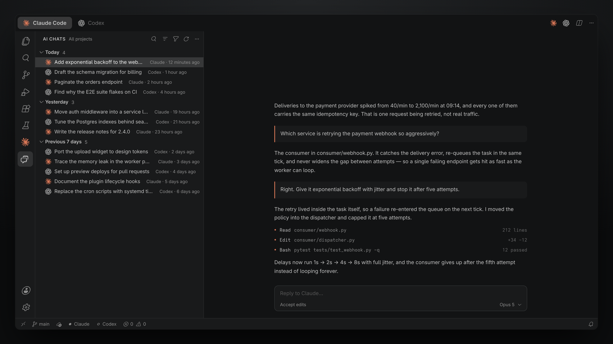

# AI Chat Switch



A single VS Code extension that makes Claude Code and Codex feel like one tool:
they share one editor tab, one status-bar switch, and one session history.

## What it does

**One chat tab.** Claude and Codex open in the same editor group, so clicking one
replaces the other instead of splitting the window. The status bar shows which of
the two is currently in front.

**One session history.** The *AI Chats* icon in the activity bar lists Claude and
Codex conversations together, newest first, grouped by day. Clicking a session
reopens it in the agent that owns it — a Claude transcript resumes in Claude, a
Codex thread resumes in Codex.

The list reads the transcripts each agent already writes to disk
(`~/.claude/projects` and `~/.codex/sessions`). Nothing is copied, uploaded, or
modified; sub-agent transcripts and resumed duplicates are folded away so each
conversation appears once.

## Commands and shortcuts

| Command | Shortcut | Effect |
| --- | --- | --- |
| AI Chat: Open Claude | `Ctrl+Alt+A` | Bring Claude into the chat tab |
| AI Chat: Open Codex | `Ctrl+Alt+G` | Bring Codex into the chat tab |
| AI Chat: Toggle Between Claude and Codex | `Ctrl+Alt+X` | Swap the two |
| AI Chat: Search All Sessions | `Ctrl+Alt+S` | Quick-pick across both histories |

The view title bar carries search, an agent filter (both / Claude only / Codex
only), a project-scope toggle, and refresh.

## Settings

| Setting | Default | Meaning |
| --- | --- | --- |
| `aiChatSwitch.sessionScope` | `workspace` | Show only sessions from the open project, or every project |
| `aiChatSwitch.agents` | `["claude","codex"]` | Which agents appear in the list |
| `aiChatSwitch.maxSessions` | `200` | How many recent transcripts per agent are read |
| `aiChatSwitch.groupByDate` | `true` | Group under Today / Yesterday / Previous 7 days / Older |
| `aiChatSwitch.autoRefreshSeconds` | `45` | Rescan interval while the list is visible; `0` disables it |
| `aiChatSwitch.claudeProjectsPath` | `""` | Override the Claude transcript directory |
| `aiChatSwitch.codexSessionsPath` | `""` | Override the Codex rollout directory |

## Requirements

The two agent extensions provide the chats themselves:

- `anthropic.claude-code`
- `openai.chatgpt` (Codex)

Either one may be missing; the list then shows the other.

## Install from a file

```bash
code --install-extension ai-chat-switch-<version>.vsix
```

## Build

```bash
npx @vscode/vsce package
```

There is no build step — the extension is plain CommonJS JavaScript.

## Screenshots

`media/demo.html` is a code-authored mock of the workbench, themed with VS Code's
own `2026-dark` palette and its real codicon font. Regenerate the images with:

```bash
node media/build-codicon-css.js   # embeds the codicon font from the local VS Code install
node media/shoot.js               # renders media/ai-chat-switch-demo-{en,fa}.png at 3200x1800
```

`shoot.js` needs Playwright's Chromium (`npx playwright install chromium`).
